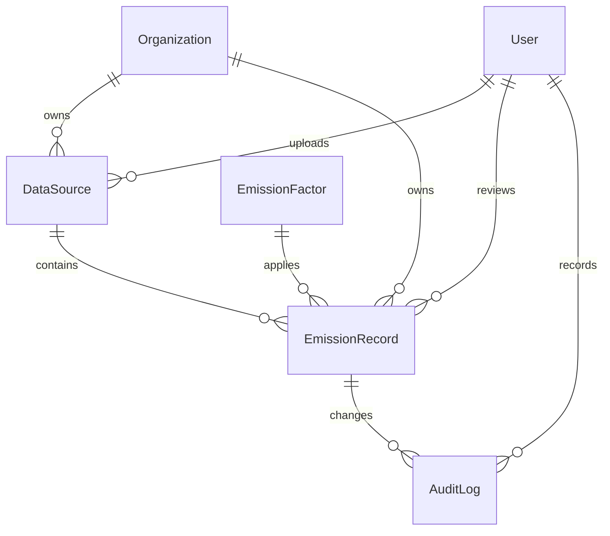

# Database Schema & Data Model Design (`MODEL.md`)

This document outlines the database schema designed for **BreatheESG Ingestor** and the business justifications for our model architectures.

---

## 1. Relational Entity Relationship Diagram

---

## 2. Model Breakdown & Database Columns

We structured our models around standard **Django 4.x ORM constraints** with enterprise considerations (UUIDs as primary keys, indexing on keys, database-level cascade controls, and JSON serialization boundaries).

### A. `Organization` (Tenant Separation)
Guarantees absolute multi-tenancy. Every record belongs to an organization.
* `id` (UUID, Primary Key): Non-sequential identifier to prevent security leaks.
* `name` (CharField, Unique): Client company name.
* `created_at` / `updated_at` (DateTimeField): Temporal tracking.

### B. `DataSource` (Audit Tracking of Files)
Holds source-of-truth metadata on every CSV upload.
* `id` (UUID, Primary Key)
* `organization` (ForeignKey -> `Organization`, CASCADE): Isolates source files per tenant.
* `file_name` (CharField): Original name of the spreadsheet.
* `uploaded_by` (ForeignKey -> `User`, SET_NULL): Traces who uploaded the spreadsheet.
* `uploaded_at` (DateTimeField): Upload timestamp.
* `source_type` (CharField, Choices: `SAP`, `UTILITY`, `TRAVEL`): Mapping to parsers.
* `row_count` (IntegerField): Stores count of valid parsed records.

### C. `EmissionFactor` (Reference Constants)
Reflects UK DESNZ 2023 greenhouse gas protocol conversion metrics.
* `id` (UUID, Primary Key)
* `name` (CharField, Unique): Friendly identifier (e.g. *Diesel - UK DESNZ 2023*).
* `category` (CharField): Operational category (FUEL, ELECTRICITY, etc.).
* `factor_key` (CharField, Unique): Search key used by parsers (e.g. `DIESEL`, `FLIGHT_LONG_HAUL`).
* `factor_value` (DecimalField, `max_digits=12`, `decimal_places=6`): kg CO2e coefficient.
* `unit` (CharField): Conversion basis (e.g. `L`, `KWH`, `PKM`).
* `source_reference` (CharField): Standards body provenance.

### D. `EmissionRecord` (Normalized Ledger Row)
The central core transaction row mapping raw data inputs to unified `kg CO2e` values.
* `id` (UUID, Primary Key)
* `organization` (ForeignKey -> `Organization`)
* `data_source` (ForeignKey -> `DataSource`, CASCADE, Nullable): Traces back to the raw source file.
* `scope` (IntegerField, Choices: `1`, `2`, `3`): GHG boundaries.
* `category` (CharField): Fuel combustion, energy, flights, hotels, ground transport.
* `activity_value` (DecimalField, `max_digits=15`, `decimal_places=4`): Normalized quantity.
* `activity_unit` (CharField): Unified calculation unit (`L`, `KWH`, `M3`, `PKM`, etc.).
* `normalized_value_kwh` (DecimalField, Nullable): Energy representation.
* `emission_factor` (ForeignKey -> `EmissionFactor`, PROTECT): Blocks deletion of historical factors.
* `co2e_kg` (DecimalField, `max_digits=18`, `decimal_places=4`): Calculated footprint.
* `period_start` / `period_end` (DateField): Ingestion temporal context.
* `source_row_number` (IntegerField): Maps exactly to the CSV row index for auditor tracebacks.
* `source_raw_json` (JSONField): Complete original un-normalized row properties.
* `status` (CharField, Choices: `PENDING`, `FLAGGED`, `APPROVED`, `LOCKED`): Governance workflow.
* `flag_reason` (TextField, Nullable): Mandatory comment if flagged.
* `reviewed_by` / `reviewed_at` (ForeignKeys): Tracks analyst signatures.

### E. `AuditLog` (Tamper-Proof Ledger History)
Maintains absolute traceability on any record edits or state updates.
* `id` (UUID, Primary Key)
* `record` (ForeignKey -> `EmissionRecord`, CASCADE)
* `changed_by` (ForeignKey -> `User`, SET_NULL)
* `changed_at` (DateTimeField)
* `action` (CharField): Action type (e.g. `CREATE`, `UPDATE_STATUS`).
* `new_value` (TextField): Concise history trail description.

---

## 3. Core Architectural Decisions

### Business Rule Decimals and Quantization
* We selected **`DecimalField`** over `FloatField` to prevent float binary representation inaccuracies (critical in auditing fields).
* Inside `save()`, all inputs are dynamically quantized to exactly **4 decimal places** (`.quantize(Decimal('0.0001'))`) prior to database clean validations.

### Model-Level Calculations
* Ingestion calculations occur dynamically during the `save()` sequence in the database layer. This acts as a database-enforced trigger ensuring that calculations are immutable and consistent, regardless of whether a record is posted via CSV upload, the REST API, or the Django Admin console.

### Multi-Triggered Audit Trails
* We embedded state tracking checks directly inside `save()`. When a record is edited, it captures the differences (e.g. status changed, values recalculated) and writes them immediately to the `AuditLog` table. This creates a secure, database-enforced timeline.
